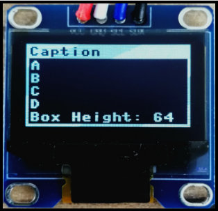
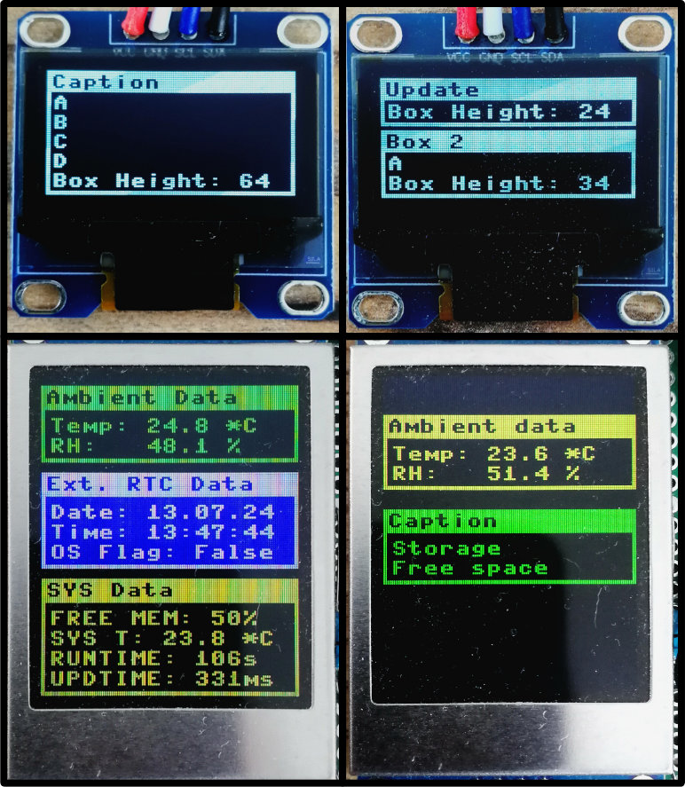

# TextBox-MPY

## Description


TextBox is used to create simple **boxes with a caption and multiple lines of text** on SSD1306-OLED / ST7735R-TFT displays using FrameBuffer-derived drivers in micropython on Raspberry Pi Pico.
Each text line is rendered in an individual FrameBuffer. 
This enables **fast updating** of the screen without flickering.

Text lines can easily be added, updated and deleted. 
Multiple TextBoxes can be created on one screen.

I use this for all my projects where I need to display text on an OLED / TFT Display.
This way, I don't have to mess around with graphic functions again and again if I want to display text / data.

## Usage

### Installation

All neccessary files are located in the `/src` folder.
The `/src/lib` folder contains the TextBox class for import and a SSD1306-OLED-Driver and a ST7735R-TFT-Driver.
The `/lib` folder needs to be copied onto the RPI using Thonny. 
The other files in the `/src` directory are examples demonstrating the use of TextBox on OLED / TFT displays.

Import TextBox and drivers in your programm:
```python
import ssd1306 # OLED driver
from ST7735R import ST7735R # TFT driver
from TextBox import TextBox, TextBoxOLED, TextBoxTFT # TextBox
from machine import Pin, I2C, SPI # Needed to initialize the displays
```


## Examples


